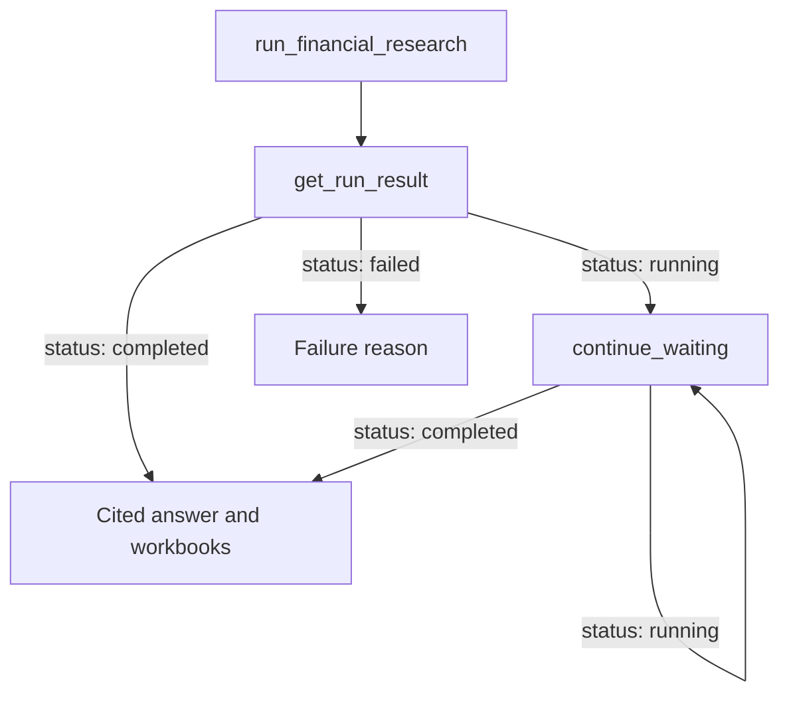

The connector exposes a set of tools that your assistant calls on your behalf. You don't call these directly. You ask in natural language, your assistant picks the right tools and chains them together, and you read the result. This page documents what each tool does, what it takes, and what it returns, so you understand what is happening and can guide your assistant when you want to.

Kepler runs are asynchronous, so the tools fall into four groups: **start** a run, **wait** for its result, **manage** existing runs, and **look up** reference data without a run.

## Tools at a glance

| Tool | Group | What it does | Blocks? |
| --- | --- | --- | --- |
| [`run_financial_research`](#run_financial_research) | Start | Begin a new research run or model request | No |
| [`continue_research`](#continue_research) | Start | Send a follow-up into an existing conversation | No |
| [`get_run_result`](#get_run_result) | Wait | Wait for a run and return its final result | Yes |
| [`continue_waiting`](#continue_waiting) | Wait | Resume waiting on a long run | Yes |
| [`is_run_done`](#is_run_done) | Wait | One-shot check of whether a run has finished | No |
| [`cancel_run`](#cancel_run) | Manage | Stop a running conversation | No |
| [`list_recent_runs`](#list_recent_runs) | Manage | List your recent conversations | No |
| [`lookup_company`](#lookup_company) | Look up | Resolve a company and list its filings and transcripts | No |
| [`get_workbook_data`](#get_workbook_data) | Look up | Export a workbook sheet as CSV | No |

## How your assistant chains the tools

Because a run continues in the background, starting one and reading its result are two separate steps. Your assistant orchestrates the loop for you:



A run usually finishes in a few minutes, though deeper models can take longer. The waiting tools hold the connection open and stream progress while Kepler reads sources, so you see narration in the conversation rather than a spinner.

## Start a run

### `run_financial_research`

Start a new Kepler run. This is the entry point for any research question or model request.

| Parameter | Type | Required | Description |
| --- | --- | --- | --- |
| `request` | string | Yes | The research question or artifact request in natural language. Include the company, the periods, and any structure or formatting preferences. |

Returns immediately with a `conversation_id` and a `status` of `running`. The run itself continues in the background. Your assistant then calls [`get_run_result`](#get_run_result) to wait for the answer.

```json
{
  "conversation_id": "c_8f3a…",
  "status": "running",
  "next_step": "Call get_run_result with this conversation_id.",
  "conversation_link": "https://app.kepler.ai/c/8f3a…"
}
```

### `continue_research`

Send a follow-up into an existing conversation. Refine a model, ask about prior results, or extend the research. The agent keeps full context from the earlier run.

| Parameter | Type | Required | Description |
| --- | --- | --- | --- |
| `conversation_id` | string | Yes | The conversation to continue. |
| `message` | string | Yes | The follow-up request in natural language. |

Returns a conversation handle, the same shape as `run_financial_research`. Follow it with a wait.

## Wait for results

### `get_run_result`

Fetch a run's final result. It blocks while the run is still going and streams progress while it waits. Finished runs return immediately, so this is also how your assistant pulls the result of an earlier run. Your assistant calls this right after starting or continuing a run.

| Parameter | Type | Required | Description |
| --- | --- | --- | --- |
| `conversation_id` | string | Yes | The conversation to wait on. |

A wait holds the connection open for a few minutes. A very long run can come back with `status: running` before it finishes. That is expected, and your assistant resumes with [`continue_waiting`](#continue_waiting). The returned object carries everything about the result:

| Field | Type | Description |
| --- | --- | --- |
| `status` | string | `running`, `completed`, `failed`, or `access_denied`. |
| `answer` | string | The final answer text, with inline citation links, when completed. |
| `failure` | string | The reason, when status is `failed`. |
| `recent_progress` | array | The latest narration updates from the run. |
| `citations` | array | The sources cited in the answer (see [citation shape](#citations-and-sources)). |
| `all_sources` | array | Everything Kepler consulted, cited or not, newest period first. |
| `workbooks` | array | Any workbooks the run produced (see [workbook shape](#workbooks)). |
| `sourcing` | object | A citation-coverage report (see [sourcing report](#sourcing-report)). |
| `conversation_link` | string | A deep link to the conversation in the Kepler app. |

### `continue_waiting`

Resume waiting after `get_run_result` returned `running`. Identical blocking behavior, used for follow-up waits on long runs. Your assistant calls it in a loop until the run completes or fails.

| Parameter | Type | Required | Description |
| --- | --- | --- | --- |
| `conversation_id` | string | Yes | The conversation to keep waiting on. |

Returns the same shape as `get_run_result`.

### `is_run_done`

A one-shot, non-blocking check of whether a run has finished. Returns right away. This is a status check, not a polling loop. To actually get the result, blocking on a running run or fetching a finished one, use `get_run_result`.

| Parameter | Type | Required | Description |
| --- | --- | --- | --- |
| `conversation_id` | string | Yes | The conversation to check. |

Returns `done` (boolean) and the current `status`.

## Manage runs

### `cancel_run`

Stop a running conversation, for example when you changed your mind, mistyped a ticker, or started a duplicate. Non-destructive: the conversation and any partial results survive, and `continue_research` can re-engage it with full context. No effect on finished runs.

| Parameter | Type | Required | Description |
| --- | --- | --- | --- |
| `conversation_id` | string | Yes | The running conversation to stop. |

Returns the `conversation_id` and a `status` of `cancelling`.

### `list_recent_runs`

List your most recent Kepler conversations. Useful for finding an earlier run, such as "the Netflix model from yesterday," to continue or fetch results from.

| Parameter | Type | Required | Description |
| --- | --- | --- | --- |
| `limit` | integer | No | Maximum conversations to return. Default `10`, clamped to 1 through 25. |

Returns a list of `runs`, newest first, each with a `conversation_id`, `title`, created and updated timestamps, and a `conversation_link`.

## Look up reference data

### `lookup_company`

Resolve a company and list the SEC filings and earnings-call transcripts Kepler has on file. Instant, with no run required. It answers questions like "is the Q3 call available?", "when did they last file a 10-K?", or "does Kepler cover this company?". It returns metadata only. For the contents of a filing, the numbers, quotes, or analysis, run a research request instead.

| Parameter | Type | Required | Description |
| --- | --- | --- | --- |
| `company` | string | Yes | Company name, ticker symbol, or SEC CIK. |
| `form_types` | string | No | Comma-separated SEC form filter, for example `"10-K,10-Q"`. |
| `limit` | integer | No | Maximum filings and transcripts to list. Default `10`, clamped to 1 through 50 each. |

Returns:

| Field | Type | Description |
| --- | --- | --- |
| `status` | string | `ok` or `no_match`. |
| `company` | object | The resolved match: `cik`, `name`, `ticker`, `total_filings`, `last_filing_date`. |
| `other_matches` | array | Alternative matches when the query is ambiguous, each with `cik`, `name`, `ticker`. |
| `filings` | array | Available filings, each with `form_type`, `filed_date`, `period_end_date`, and `fiscal_period` (for example `Q1 FY2026`). |
| `transcripts` | array | Available earnings-call transcripts, each with `title`, `fiscal_period`, and `event_date`. |

### `get_workbook_data`

Get the full cell data of one workbook sheet as CSV (RFC 4180), for downstream analysis beyond the tables shown in a result. Omit `sheet_name` to list a multi-sheet workbook's sheets first.

| Parameter | Type | Required | Description |
| --- | --- | --- | --- |
| `workbook_id` | string | Yes | Workbook id from a run result. |
| `sheet_name` | string | No | Sheet to export, case-insensitive. Optional when the workbook has a single sheet. |

Returns the sheet as CSV text, alongside the `workbook_id`, the workbook `name`, and the list of available `sheets`.

## Result shapes

The result-bearing tools share a few nested structures. Knowing the field names helps you read what your assistant brings back, and ask it for more.

### Citations and sources

Each entry in `citations` and `all_sources` describes one source:

| Field | Type | Description |
| --- | --- | --- |
| `n` | integer | The citation number, matching the inline marker in the answer (`citations` only). |
| `label` | string | A human-readable source label, for example `Apple 10-K (FY2024)`. |
| `url` | string | A link to the source, when one is available. |
| `kind` | string | The source type: `filing`, `transcript`, `market-data`, `presentation`, `news`, `web`, and a few others. |

`citations` are the sources actually referenced in the answer. `all_sources` is everything Kepler consulted, whether cited or not, ordered newest period first.

### Workbooks

Each workbook in a result includes:

| Field | Type | Description |
| --- | --- | --- |
| `workbook_id` | string | The id to pass to [`get_workbook_data`](#get_workbook_data). |
| `name` | string | The workbook title. |
| `sheets` | array | The sheet names in the workbook. |
| `link` | string | A link to open the workbook in the Kepler app. |
| `download_url` | string | A link to download the workbook as `.xlsx`. |

### Sourcing report

The `sourcing` object summarizes how much of the answer is backed by citations:

| Field | Type | Description |
| --- | --- | --- |
| `cited_count` | integer | The number of distinct figures cited. |
| `uncited_figures` | integer | The count of numbers in the answer with no citation. |
| `fully_cited` | boolean | Whether every number in the answer is cited. |

Lead with this when work has to be right: it tells you, at a glance, whether an answer is fully sourced before you rely on it.

<Note>
  Tool names, parameters, and behavior are set by the connector and may evolve. Your assistant always sees the current definitions when it connects, so you don't need to track changes yourself. For the canonical list, point your client at the connector and read its advertised tools.
</Note>
